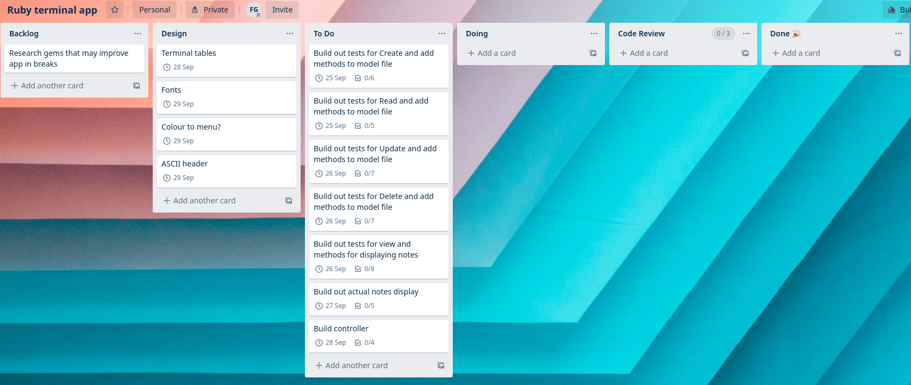
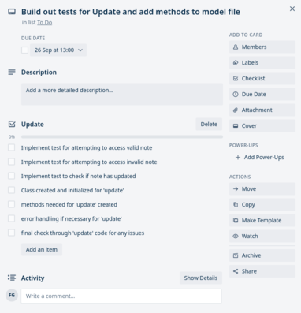

# ToDoList CLI

## Table of contents

[1. Links](#links)  
[2. What does ToDoList CLI do?](#What-does-ToDoList-CLI-do?)  
[3. What problem does this app solve? and why am I developing it?](#What-problem-does-this-app-solve?-Why-am-I-developing-it?)  
[4. Target audience and how they will use it](#Target-audience-and-how-they-will-use-it)  
[5. ToDoList CLI Features](#ToDoList-CLI-Features)  
[6. An outline of user interaction](#An-outline-of-user-interaction)  
[7. Control flow diagram for the app](#Control-flow-diagram-for-the-app)  
[8. Implementation plan - Trello](#Implementation-plan---Trello)  
[9. System requirements](#System-requirements)  
[10. How to install and run ToDoList CLI](#How-to-install-and-run-ToDoList-CLI)  

## This project is hosted on Github, links below

[Github: ToDoList CLI](https://github.com/Finbob12/ToDoList-CLI)

## Purpose and scope of the application

### What does ToDoList CLI do?

The ToDoList CLI is a command line interface application that works as a to do list. This application turns your command line into an easy to use notepad, that conveniently stores notes for later use. These notes can be created, read, updated and deleted at the user's ease of command. When the application is launched a simple menu appears asking the user what actions they would like to take. This menu will change depending on how the user interacts with it and continue to give helpful instrucitons to guide the user through using the application. The user will also be informed that they can type `-h` or `help` at any time to receive further instructions if they are confused. The user will also be told how to exit the application by typing `q` or `quit` at any time.

### What problem does this app solve? Why am I developing it?

This application solves the issue of not being able to use a notepad without opening a large, detailed, bloated application. Most notepad applications will be overly convoluted, rather than simple and elegant like ToDoList CLI. Most notepad applications require you to find the app in your ever growing list of unused apps, boot it up, wait for it to open, and navigate a clunky GUI just to write down that you need some milk. I'm developing ToDoList CLI so you can `CTRL + ALT + T` and type "I NEED MILK" before your friend using "Super Notes App 3k" can even find their app.

### Target audience and how they will use it

The target audience for this app is anyone that understands how to use the command line. If you can use the command line, then you can use ToDoList CLI. This target user will be going about their day-to-day tasks when they suddenly think or something they need to remember later. `CTRL + ALT + T` and write it down, ToDoList CLI is coming to your town.

## ToDoList CLI Features - expand on this later

ToDoList CLI has all the featured necessary for a premier notes application.
The interactive menu - A self explanatory menu in your terminal guiding your navigation with simple text inputs from the user.
Create - The most important feature of the app, the ability to create your own notes and have the app save them.
Read - Easy accessibility to read notes you have previously saved.
Update - Ability to update or edit notes that have been previously created.
Delete - Specify which note you would like to delete and it will be removed from the app.

## An outline of user interaction - do this later with screenshots

## Control flow diagram for the app - do this later

## Implementation plan - Trello

The below two images are from my initial Trello plan. I've set myself acceptable timeframes to complete each task, allowing for extra days before the project is due for any complications or extra features I may want to add.

 

## System requirements

## How to install and run ToDoList CLI - do this at the end
