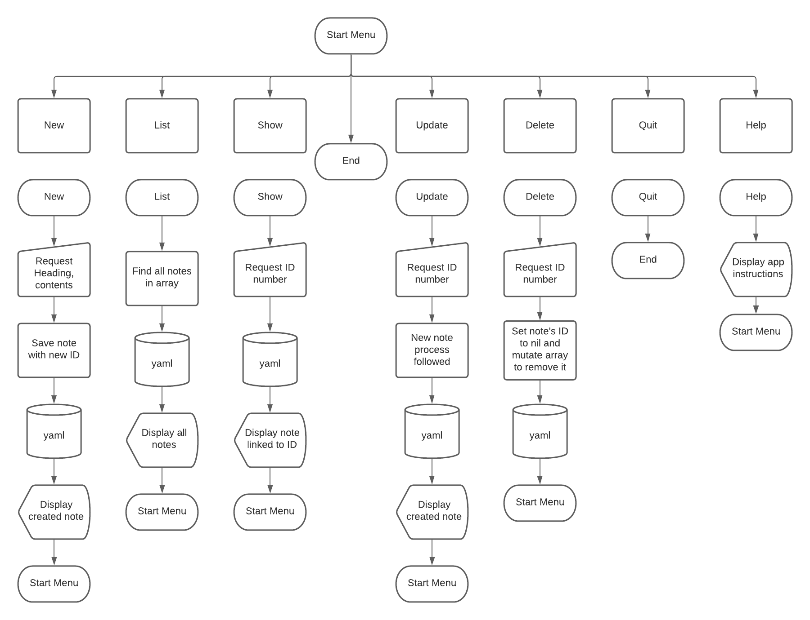
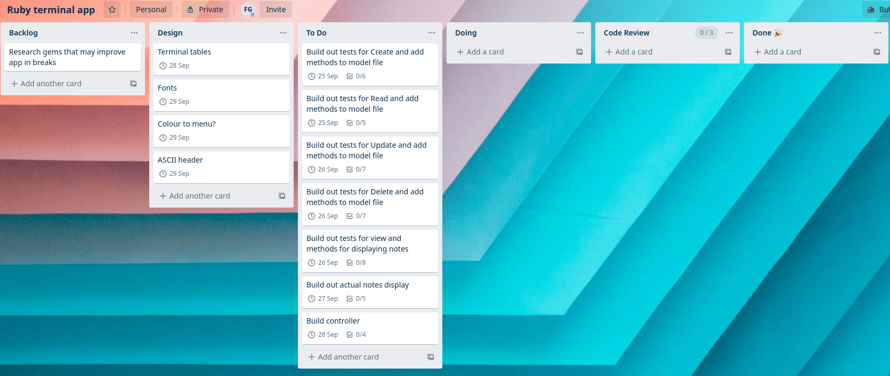
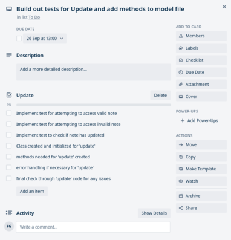

# ToDoList CLI

## Table of contents

[1. Project Links](#Project-Links)  
[2. What does ToDoList CLI do?](#What-does-ToDoList-CLI-do?)  
[3. What problem does this app solve? and why am I developing it?](#What-problem-does-this-app-solve?-Why-am-I-developing-it?)  
[4. Target audience and how they will use it](#Target-audience-and-how-they-will-use-it)  
[5. ToDoList CLI Features](#ToDoList-CLI-Features)  
[6. An outline of user interaction](#An-outline-of-user-interaction)  
[7. Control flow diagram for the app](#Control-flow-diagram-for-the-app)  
[8. Implementation plan - Trello](#Implementation-plan---Trello)  
[9. System requirements](#System-requirements)  
[10. How to install and run ToDoList CLI](#How-to-install-and-run-ToDoList-CLI)  

## Project Links

[Github: ToDoList CLI](https://github.com/Finbob12/ToDoList-CLI)

## Purpose and scope of the application

### What does ToDoList CLI do?

The ToDoList CLI is a command line interface application that works as a to do list. This application turns your command line into an easy to use notepad, that conveniently stores notes for later use. These notes can be created, read, updated and deleted at the user's ease of command. When the application is launched a simple menu appears asking the user what actions they would like to take. This menu will change depending on how the user interacts with it and continue to give helpful instrucitons to guide the user through using the application. The user will also be informed that they can use the `help` option at any time to receive further instructions if they are confused. The user will also be told how to exit the application by choosing the `quit` option at any time.

### What problem does this app solve? Why am I developing it?

This application solves the issue of not being able to use a notepad without opening a large, detailed, bloated application. Most notepad applications will be overly convoluted, rather than simple and elegant like ToDoList CLI. Most notepad applications require you to find the app in your ever growing list of unused apps, boot it up, wait for it to open, and navigate a clunky GUI just to write down that you need some milk. I'm developing ToDoList CLI so you can `CTRL + ALT + T` and type "I NEED MILK" before your friend using "Super Notes App 3k" can even find their app.

### Target audience and how they will use it

The target audience for this app is anyone that understands how to use the command line. If you can use the command line, then you can use ToDoList CLI. This target user will be going about their day-to-day tasks when they suddenly think or something they need to remember later. `CTRL + ALT + T` and write it down, ToDoList CLI is coming to your town.

## ToDoList CLI Features

ToDoList CLI has all the featured necessary for a premier notes application.

- The interactive menu. A self explanatory menu in your terminal guiding your navigation with simple text inputs from the user.
- New - The most important feature of the app, the ability to create your own notes and have the app save them.
- List - Easy accessibility to read notes you have previously saved.
- Show - View a specific note that has been previously written for closer inspection.
- Update - Ability to update or edit notes that have been previously created.
- Delete - Specify which note you would like to delete and it will be removed from the app.

## An outline of user interaction

When the user first launches the application they will be greeted with a very simple, clear and consise menu that should be self-explantory. If the user is still after further clarification on what they should do, they can select the help option which will provide them with a detailed beakdown of the menu options available.
Each feature can be easily used by selecting it from the main menu. Show, Update and Delete also require an ID number to be inputted for their functionality to be accessed. If these ID's are forgotten, the user can simply use the List feature to view them again.
At any time if the user incorrectly inputs something, or attempts to input nothing for a note, the system will give them a message telling them what the exact issue was and how they can resolve it.

## Control flow diagram for the app



## Implementation plan - Trello

Link to the live Trello board is [here](https://trello.com/b/XyIxIzrm/ruby-terminal-app)

The below two images are from my initial Trello plan. I've set myself acceptable timeframes to complete each task, allowing for extra days before the project is due for any complications or extra features I may want to add. This initial plan changed a few times as I edited my board to better fit the exact scope of the project. An MVP was the main goal of the process, while also keeping in mind design elements that I wanted to add to make the project more appealing. Further screenshots of my Trello board as it was updated day to day are located [here](/readme_images/trello)

 

## System requirements

The only system requirement is a computer that has bash script capability.

## Installation of the application

- Follow these instructions to [download and install](https://www.ruby-lang.org/en/documentation/installation/) Ruby on your computer.
- Clone the Github repository or download the Zip file and extract it onto your local machine.
- Open your terminal and run the following command after navigating to the projects main folder.

```$ gem install bundler```

- After bundle is installed, run the next command below.

```$ bundle install```

- Then to launch the application type the following.

```$ ./run_app.sh```

## Dependencies for the application

The below Ruby gems are required for the application, though if you followed the above instructions all should be included.

- gem "rspec", "~> 3.9"
- gem "tty-table", "~> 0.12.0"
- gem "colorize", "~> 0.8.1"
- gem "tty-prompt", "~> 0.22.0"
- gem "artii", "~> 2.1"
- gem "rainbow", "~> 3.0"
